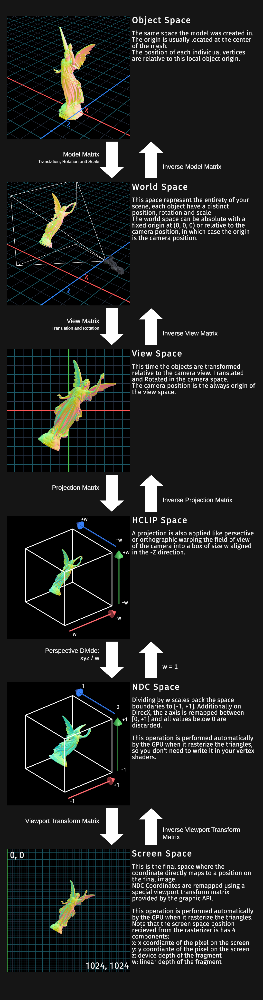

# Graphics Transformation Pipeline

A comprehensive guide to coordinate spaces, transformation matrices, and the rendering pipeline in real-time graphics.

## Overview

Every vertex in a 3D scene undergoes a series of transformations before appearing on screen. Understanding this pipeline is essential for any graphics programmer.



*The complete transformation pipeline from Object Space to Screen Space. Credit: alelievr.github.io*

---

## Coordinate Spaces

### Object Space (Model Space)

The local coordinate system of a single mesh.

- **Origin**: Typically at the mesh's geometric center (0, 0, 0)
- **Purpose**: Vertices are stored relative to this local origin
- **Example**: A cube's vertices range from (-0.5, -0.5, -0.5) to (0.5, 0.5, 0.5)

Each object has its own object space, regardless of where it's placed in the world.

---

### World Space

The global coordinate system of the entire scene.

- **Origin**: The world origin (0, 0, 0) — typically a fixed reference point
- **Purpose**: All objects are positioned relative to this common origin
- **Transformation**: `Model Matrix` transforms Object → World

The Model Matrix combines three operations:
```
M_model = T(translation) × R(rotation) × S(scale)
```

Applied in this order: scale first, then rotate, then translate.

---

### View Space (Camera Space)

The coordinate system from the camera's perspective.

- **Origin**: The camera position
- **Axes**: +X points right, +Y points up, +Z points forward (left-handed) or backward (right-handed)
- **Purpose**: Vertices are expressed relative to the camera
- **Transformation**: `View Matrix` transforms World → View

#### The View Matrix in Detail

The view matrix is constructed using the **lookAt** function:

```
v_lookAt = normalize(target - eye)     // Forward direction (Z axis)
v_right  = normalize(cross(v_lookAt, worldUp))  // Right direction (X axis)  
v_up     = cross(v_right, v_lookAt)    // Up direction (Y axis)
```

The complete view matrix:

$$
\begin{bmatrix}
v_{right}.x & v_{right}.y & v_{right}.z & -\mathbf{v_{right}} \cdot \mathbf{eye} \\
v_{up}.x    & v_{up}.y    & v_{up}.z    & -\mathbf{v_{up}} \cdot \mathbf{eye} \\
v_{lookAt}.x & v_{lookAt}.y & v_{lookAt}.z & -\mathbf{v_{lookAt}} \cdot \mathbf{eye} \\
0           & 0           & 0           & 1
\end{bmatrix}
$$

**Key insight**: The view matrix doesn't actually move the camera. It moves the entire world in the **opposite direction**, making it appear as if the camera is at the origin.

---

### Clip Space

The space after projection but before perspective division.

- **Purpose**: Contains vertices in homogeneous coordinates
- **Property**: Vertices are in a frustum-shaped volume
- **Next step**: Perspective divide transforms this to NDC

The projection matrix transforms View → Clip Space.

---

### NDC (Normalized Device Coordinates)

After the perspective divide, vertices are in NDC.

- **Range**: [-1, 1] for X and Y, [0, 1] for Z (D3D/Vulkan) or [-1, 1] for Z (OpenGL)
- **Purpose**: GPU uses these for clipping and viewport mapping
- **The perspective divide**:

$$
x_{ndc} = \frac{x_{clip}}{w_{clip}} \quad
y_{ndc} = \frac{y_{clip}}{w_{clip}} \quad
z_{ndc} = \frac{z_{clip}}{w_{clip}}
$$

This division by W (which equals the original Z depth) is what creates the **perspective effect** — far objects appear smaller.

---

### Screen Space

The final pixel coordinates on the render target.

- **Range**: [0, width] for X, [0, height] for Y
- **Transformation**: Viewport transform maps NDC [-1, 1] to pixel coordinates
- **Performed by**: GPU automatically after vertex shader

---

## The Transformation Pipeline

The complete chain of transformations:

$$
v_{clip} = P \times V \times M \times v_{object}
$$

Where:
- $M$ = Model matrix (Object → World)
- $V$ = View matrix (World → Camera)
- $P$ = Projection matrix (Camera → Clip)
- $v_{object}$ = Vertex in object space
- $v_{clip}$ = Vertex in clip space

Then the GPU performs:
1. **Perspective divide**: $v_{ndc} = v_{clip} / w$
2. **Viewport transform**: $v_{screen} = \text{Viewport}(v_{ndc})$

---

## Projection Matrices

### Perspective Projection

Creates a **frustum** (truncated pyramid) to simulate realistic depth perception.

**Parameters**:
- `fovY`: Vertical field of view angle (radians)
- `aspect`: Aspect ratio (width / height)
- `near`: Distance to near clipping plane
- `far`: Distance to far clipping plane

**Left-handed system matrix** (D3D/Vulkan, depth [0, 1]):

$$
\begin{bmatrix}
\frac{f}{aspect} & 0 & 0 & 0 \\
0 & f & 0 & 0 \\
0 & 0 & \frac{far}{far - near} & \frac{-near \cdot far}{far - near} \\
0 & 0 & 1 & 0
\end{bmatrix}
$$

Where $f = \frac{1}{\tan(fovY/2)}$ (focal length).

**Properties**:
- Objects farther away appear smaller
- Parallel lines converge to vanishing points
- Mimics human vision and camera optics

---

### Orthographic Projection

Creates a **box** (rectangular prism) with no perspective distortion.

**Parameters**:
- `left`, `right`: Horizontal clipping bounds
- `bottom`, `top`: Vertical clipping bounds
- `near`, `far`: Depth clipping bounds

**Matrix**:

$$
\begin{bmatrix}
\frac{2}{right - left} & 0 & 0 & -\frac{right + left}{right - left} \\
0 & \frac{2}{top - bottom} & 0 & -\frac{top + bottom}{top - bottom} \\
0 & 0 & \frac{1}{far - near} & -\frac{near}{far - near} \\
0 & 0 & 0 & 1
\end{bmatrix}
$$

**Properties**:
- No perspective foreshortening
- Objects remain the same size regardless of distance
- Used for UI, 2D games, architectural drawings, isometric views

---

### Comparison

| Feature | Perspective | Orthographic |
|---------|-------------|--------------|
| Volume | Frustum (pyramid) | Box (rectangular prism) |
| Size vs distance | Far = smaller | Constant size |
| Parallel lines | Converge | Stay parallel |
| Use cases | 3D scenes, games | UI, 2D, CAD |
| Visual result | Realistic depth | Technical/flat |

---

## Important Details

### Why Matrix Order Matters

Matrix multiplication is **not commutative**: $AB \neq BA$

When combining transformations, the matrix **closest to the vector** is applied **first**:

```
v_final = M_3 × M_2 × M_1 × v_original
          ↑    ↑    ↑
         3rd  2nd  1st
```

This is why:
```cpp
m_ViewProjectionMatrix = m_ProjectionMatrix * m_ViewMatrix;
//                        ↑                ↑
//                      applied 2nd      applied 1st
```

The view matrix transforms to camera space first, then the projection matrix applies perspective.

### Left-Handed vs Right-Handed Systems

| System | +Z Points | Depth Range | Used By |
|--------|-----------|-------------|---------|
| Left-handed | Forward (into screen) | [0, 1] | D3D, Vulkan |
| Right-handed | Backward (out of screen) | [-1, 1] | OpenGL |

**GLM configuration for D3D/Vulkan**:
```cpp
#define GLM_FORCE_LEFT_HANDED
#define GLM_FORCE_DEPTH_ZERO_TO_ONE
```

These defines ensure GLM produces matrices compatible with D3D11, D3D12, and Vulkan conventions.

### Depth Precision

Depth values are **not linearly distributed** in perspective projection:

- High precision near the camera
- Low precision far from the camera

This is because the Z mapping is a **hyperbolic function**, not linear. For this reason:
- Keep `near` plane as far from the camera as possible
- Don't set `far` plane unnecessarily large
- Typical values: `near = 0.1`, `far = 100` for most scenes

---

## References

1. **Modern Rendering Introduction** — alelievr  
   [Matrices and Transformations](https://alelievr.github.io/Modern-Rendering-Introduction/MatricesAndTransformations/#transformation-pipeline)  
   *Source of the transformation pipeline diagram and foundational concepts.*

2. **GLM Documentation** — G-Truc  
   [glm::perspective](https://glm.g-truc.net/0.9.9/api/a00665.html) | [glm::lookAt](https://glm.g-truc.net/0.9.9/api/a00663.html)  
   *Reference for GLM matrix functions used in this project.*

3. **LearnOpenGL** — Joey de Vries  
   [Coordinate Systems](https://learnopengl.com/Getting-started/Coordinate-Systems)  
   *Comprehensive explanation of the graphics pipeline spaces.*

4. **Microsoft Direct3D Documentation**  
   [Coordinate Systems](https://learn.microsoft.com/en-us/windows/win32/direct3d9/coordinate-systems)  
   *Left-handed coordinate system conventions for D3D.*
